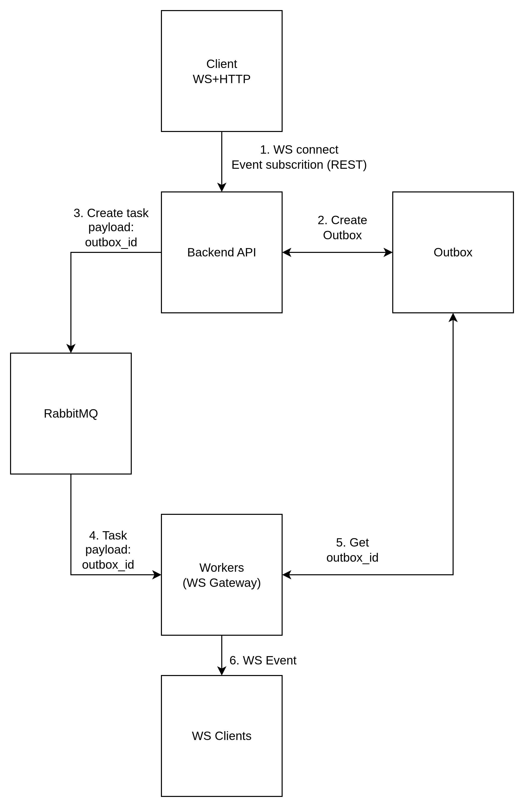

# Case Study: WebSocket Event Delivery System

| Problem | Solution | Impact |
|---|---|---|
| Need reliable, tenant-aware event delivery with retries and deduplication. | Transactional Outbox + Queue + WS Gateway; topics per tenant; dedup_key and exponential backoff retries. | At-least-once delivery with idempotency, scalable multi-tenant delivery and clear separation of concerns. |

Key points:

- Outbox guarantees events are only published for committed transactions
- Queue handles orchestration and retries, not long-term storage
- Topics: tenant:{tenant_id}:{entity}:{entity_id}

---

## Problem
We needed a reliable, asynchronous delivery system for client events with guarantees:
- deliver only committed changes
- support multiple tenants
- handle retries, deduplication, and idempotency
- allow clients to subscribe only to relevant events

## Solution
- **Transactional Outbox**: all events created within ORM transactions
- **Queue**: triggers delivery tasks, manages retries
- **WS Gateway**: maintains connections and subscriptions, no business logic

### Key Concepts
- `dedup_key` for collapsing multiple similar events
- Retry mechanism with exponential backoff
- Topics structured as `tenant:{tenant_id}:{entity}:{entity_id}`
- Clients subscribe via POST `/ws/subscriptions` with full topic list

## Impact
- At-least-once delivery with idempotency
- Scalable multi-tenant event delivery
- Separation of persistence, delivery, and connection handling

## Lessons Learned
- Outbox as source of truth simplifies event reliability
- Queues should orchestrate, not store events
- Deduplication is essential for high-frequency updates

