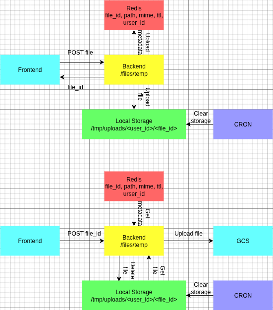

# Case Study: Temporary File Upload Handling

| Problem | Solution | Impact |
|---|---|---|
| Multi-step form uploads using JSON + multipart risk data loss and concurrency issues. | Temporary storage + Redis metadata (file_id, path, TTL); finalize to permanent storage on submit. | Reliable multi-step uploads, concurrent-safe, simple integration with existing forms. |

Key points:

- Temporary files stored under `/tmp/uploads/<user_id>` with TTL
- Metadata in Redis allows validation and concurrent workflows
- Finalization uploads file to permanent storage (e.g., GCS) and cleans temp data

---

## Problem
Frontend needed to upload user files in multi-step forms using:
- JSON requests for form data
- multipart/form-data for files

Challenges:
- prevent data loss
- support concurrent multi-request uploads
- validate before final submission

## Solution
- Add temporary backend storage (`/tmp/uploads/<user_id>`)
- Store metadata in Redis (file_id, path, MIME, TTL, user_id)
- Flow:
  1. User selects file → POST `/files/temp` (multipart/form-data)
  2. File saved locally + metadata in Redis
  3. Final form submit → backend validates file, uploads to permanent storage (GCS), deletes temp file

## Impact
- Reliable multi-step uploads
- Supports concurrent users
- Simple integration with existing forms

## Lessons Learned
- Temporary storage + metadata system is simple and reliable
- Decouples file handling from form submission
- Allows safe multi-request workflows

